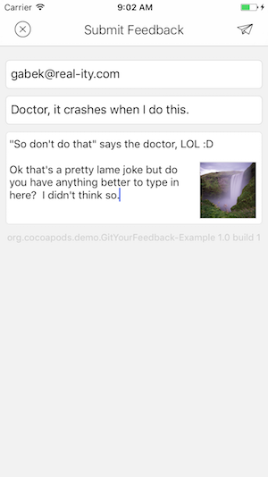
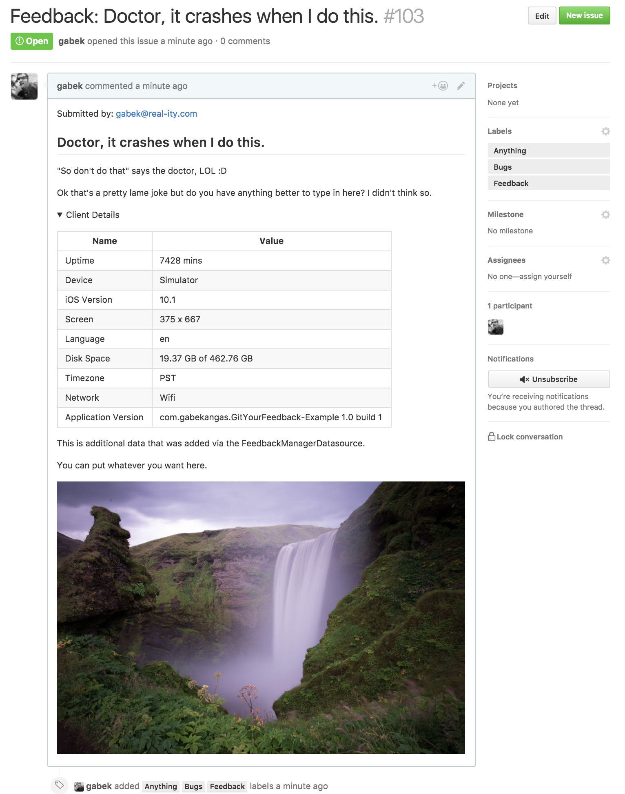
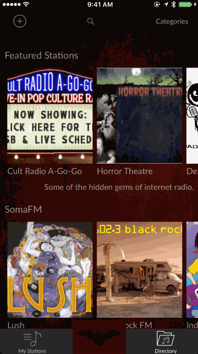

# GitYourFeedback

[](https://github.com/gabek/GitYourFeedback)
[](https://github.com/gabek/GitYourFeedback)


A lot of organizations run on GitHub, not just for the code repositories, but also for the heavy use of Issues, the bug tracking/feedback reporting tool.  Instead of routing your users to GitHub and expecting them to file issues, this is an option to support it right from inside your iOS application.

## Example

To run the example project:

* Clone the repo, and run `pod install` from the Example directory.
* Edit `Config.swift` and add your GitHub details (user, api key, repo) and Google Cloud Storage bucket name.
* This must be a publicly accessible Google Cloud Storage bucket, as it needs permissions to upload and read the file.
* Run the project either on a device and take a screenshot, or press the button in the simulator to bring up the feedback interface.

### The client will look like: 



### While the resulting GitHub issue will look like:



## Requirements
* Google Cloud Storage bucket for storing the screenshots.
* GitHub repository for storing the issues.

## Dependencies
* If you install via Cocoapods these dependencies are handled for you, as they're listed in the Podspec.
* CLImageEditor is used for editing the screenshot after it's taken.  This can be fore redacting personal information
or calling out speficic items.
* GRMustache is used to enable the Mustache templating used for `issueTemplate.md`.  It allows iteration of the actual issue content
without code.

## Installation

GitYourFeedback is available through [CocoaPods](http://cocoapods.org). To install
it, simply add the following line to your Podfile:

```ruby
pod "GitYourFeedback"
```

Or, if you’re using [Carthage](https://github.com/Carthage/Carthage), add GitYourFeedback to your Cartfile:

github "gabek/GitYourFeedback"

1. Generate a [Personal Access Token](https://help.github.com/articles/creating-an-access-token-for-command-line-use/) for the GitHub user who will be saving the issues in your repo.

2. In your project's `Info.plist` add a key of `NSPhotoLibraryUsageDescription` with a string explaining that your use of the photo library is for submitting screenshots.  This is user-facing so use your own judgement.

3. Create a `FeedbackReportingOptions` object and fill in the properties.  As simple as:
```
let feedbackOptions = FeedbackReportingOptions(token: "abc123", user: "repoman", repo: "repoman/myRepository")
```
Alternatively you can create your own struct that adheres to the `FeedbackOptions` protocol and use that instead.  So you don't have to keep all the intialization values inline.

4. In your AppDelegate, or some other long-lived controller:


```
let feedbackReporter = FeedbackReporter(options: feedbackOptions, datasource: self)
```

You'll need to implement `FeedbackReporterDatasource` in order to tell the FeedbackReporter where to upload screenshots.  The simplest implementation would be something like:

```
func uploadUrl(_ completionHandler: (String) -> Void) {
    let filename = String(Date().timeIntervalSince1970) + ".jpg"
    let url = "https://www.googleapis.com/upload/storage/v1/b/mybucketname.appspot.com/o?name=\(filename)"
    completionHandler(url)
}
```
This is also where you could generate, possibly from your backend, a signed URL so the Google Cloud Storage bucket doesn't need to be completely public.


There are other methods you can implement as well, to provide additional information in the issues that get filed.

```
func additionalData() -> String?
func issueLabels() -> [String]?
```


## Presenting the Feedback interface

The interface will automatically display as a result of a user taking a screenshot.  If this is the first time the user has taken a screenshot in your application they will be greeted with an iOS permissions dialog stating they need to grant your app access to the user's Photos in order to use the screenshot.  You may want to emphasize that the user should accept this.  It uses the copy you added in your Info.plist's `NSPhotoLibraryUsageDescription` key.

You could also manually fire `feedback.display()` with an optional specific view controller to present from.  With this approach the user will have to select their own screenshot manually if they want to send one.



## Author

Gabe Kangas, gabek@real-ity.com.  [@gabek](http://twitter.com/gabek)

Icon credits: designed by [Madebyoliver](http://www.flaticon.com/packs/essential-set-2) from Flaticon.

## License

GitYourFeedback is available under the [MIT license](https://github.com/gabek/GitYourFeedback/blob/master/LICENSE). See the LICENSE file for more info.
